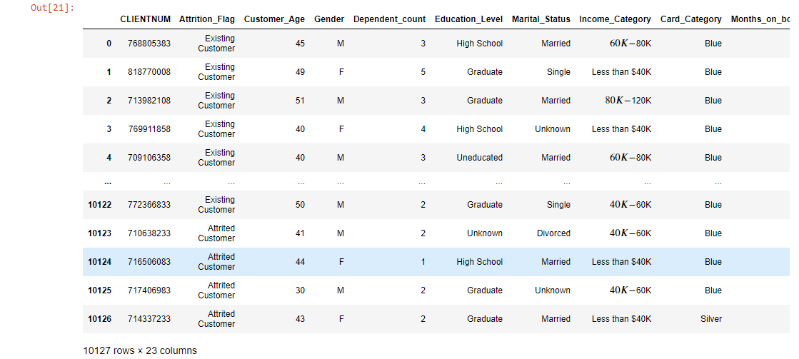
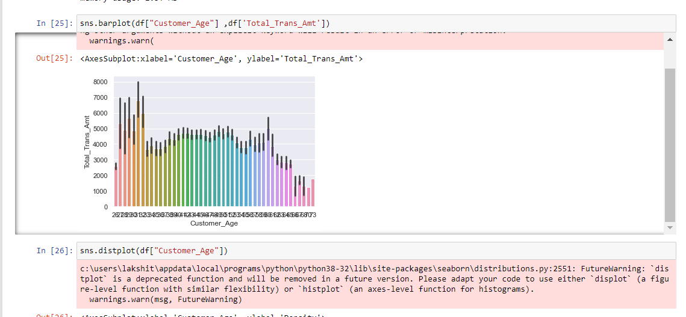

# Seaborn-Data-Visualization
 
## What is SeaBorn?
Seaborn is a library for making statistical graphics in Python. It builds on top of matplotlib and integrates closely with pandas data structures. Seaborn helps you explore and understand your data.
 

## How we are using this Library?

-First we load the csv file using pandas(fig 1.1)

-Then we Plot Different kinds of graph with x variable as "Customer's Age" and y variable as "Total Transations"(fig 1.2)

 

## Usings these graphs we are trying to find the average age of person who uses credit card

 

## Data Source
This Data has been imported from kaggle.com
